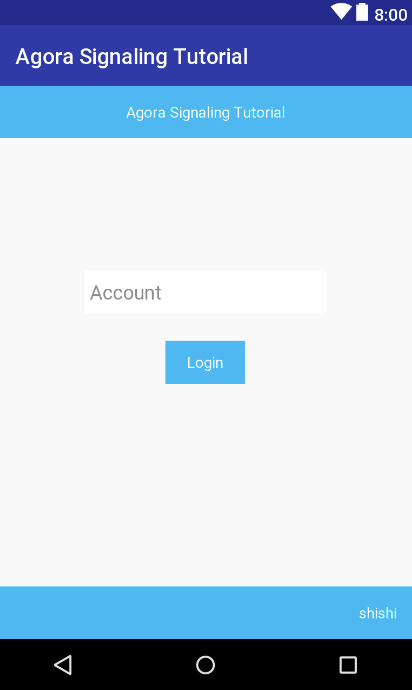
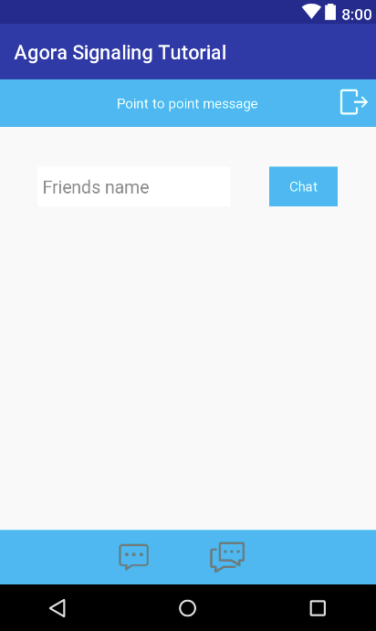
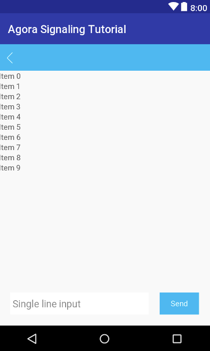

# Agora Android Signaling Tutorial

## Steps to Create the Sample Project

* [Set Permissions](#set-permissions)
* [Create Visual Assets](#create-visual-assets)
* [Design the User Interface](#design-the-user-interface)

For details about the APIs used to develop this sample, see the [Agora Android Signaling API Documentation](https://docs.agora.io/en/Signaling/signal_android?platform=Android).

### Set Permissions
In the `AndroidManifest.xml` file, `uses-permissions` settings were added for the Internet, audio recording, audio settings, network state, camera, and external storage, to allow the app to access these features:

``` xml
<?xml version="1.0" encoding="UTF-8"?>
<manifest xmlns:android="http://schemas.android.com/apk/res/android"
    package="io.agora.sginatutorial">

    <uses-permission android:name="android.permission.INTERNET" />
    <uses-permission android:name="android.permission.RECORD_AUDIO" />
    <uses-permission android:name="android.permission.MODIFY_AUDIO_SETTINGS" />
    <uses-permission android:name="android.permission.ACCESS_NETWORK_STATE" />
    <uses-permission android:name="android.permission.CAMERA" />
    <uses-permission android:name="android.permission.WRITE_EXTERNAL_STORAGE" />

    <application
        android:name=".AGApplication"
        android:allowBackup="true"
        android:icon="@drawable/ic_launcher"
        android:label="@string/app_name"
        android:supportsRtl="true"
        android:theme="@style/AppTheme">
        <activity
            android:name="io.agora.activity.LoginActivity"
            android:screenOrientation="sensorPortrait">
            <intent-filter>
                <action android:name="android.intent.action.MAIN" />

                <category android:name="android.intent.category.LAUNCHER" />
            </intent-filter>
        </activity>
        <activity android:name="io.agora.activity.SelectChannelActivity"
            android:screenOrientation="portrait"/>
        <activity android:name="io.agora.activity.MessageActivity"
            android:screenOrientation="portrait" />
    </application>

</manifest>
```

### Create Visual Assets
The following icon assets for the user interface were added to the `\res\drawable` directory:

|Asset                   |Description                                                                                        |
|------------------------|---------------------------------------------------------------------------------------------------|
|`ic_launcher.png`|The main icon for the application.|
|`icon_back.png`|An arrow for the application's back button.|
|`icon_chat_channel.png`|An image of two gray callouts indicating that *channel messaging* is disabled.|
|`icon_chat_channel_P.png`|An image of two white callouts indicating that *channel messaging* is enabled.|
|`icon_chat_onetoone.png`|An image of one gray callout indicating that *point-to-point messaging* is disabled.|
|`icon_chat_onetoone_p.png`|An image of one white callout indicating that *point-to-point messaging* is enabled.|
|`icon_msg_I.9.png`|An image of a white callout that represents a message received from a recipient.|
|`icon_msg_r.9.png`|An image of a blue callout that represents a message sent to a recipient.|
|`logout.png`|An image consisting of a square and an arrow used for the application's logout button.|

### Design the User Interface
The sample project contains the following `Activity` classes:
* [LoginActivity](#loginactivity)
* [SelectChannelActivity](#selectchannelactivity)
* [MessageActivity](#messageactivity)

#### LoginActivity
`LoginActivity` provides a user interface for the user to log in to Agora. Its layout is defined in `\layout\activity_login.xml`.

The main aspects of this layout are shown here:



|Component                        |Description                                                                                                                                 |
|---------------------------------|--------------------------------------------------------------------------------------------------------------------------------------------|
|`login_title`       |A banner that displays the title of the application.|
|`button_login`       |A button that logs the user in to Agora.|
|`account_name`       |An input field in which the user enters their account ID.|
|`login_version`       |A text field that displays the version of the Agora API used by the application.|

#### SelectChannelActivity
`SelectChannelActivity` provides a user interface for the user to select either *point-to-point messaging* or *channel messaging*. Its layout is defined in `\layout\activity_message.xml`.

The main aspects of this layout are shown here:



|Component                        |Description                                                                                                                                 |
|---------------------------------|--------------------------------------------------------------------------------------------------------------------------------------------|
|`select_channel_title`       |A banner that displays either *Point to point message* or *Channel message* to indicate the selected messaging mode.|
|`ImageView`       |A button that returns the user to the previous screen.|
|`select_channel_button`       |A button that starts a chat with the entity specified in the `select_channel_edittext` field. For *point-to-point messaging*, the button is labeled `Chat` and invokes a direct message chat with the user specified in `select_channel_edittext`. For *channel messaging*, the button is labeled `Join` and enters the channel specified in `select_channel_edittext`.|
|`select_channel_edittext`       |An input field in which the user specifies either the name of a user to chat with, or the name of a channel to enter for messaging.|
|`select_mode_group`       |A pair of radio buttons that selects either *point-to-point messaging* or *channel messaging*.|

#### MessageActivity
`MessageActivity` provides a user interface for the user to enter, receive, and view messages. Its layout is defined in `\layout\activity_message.xml`.

The main aspects of this layout are shown here:



|Component                        |Description                                                                                                                                 |
|---------------------------------|--------------------------------------------------------------------------------------------------------------------------------------------|
|`message_title`       |For *point-to-point messaging*, this banner displays the name of the other user in the chat. For *channel messaging*, this banner displays the name of the message channel.|
|`ImageView`       |A button that returns the user to the previous screen.|
|`select_channel_button`       |A button that sends the current message entered by the user in `message_edittext`, to the other user or channel.|
|`message_edittext`       |An input field in which the user enters a message.|
|`message_list`       |A list that displays all of the messages for the chat.|


## Configure Resources
To configure communication resources:
* [Create an AgoraAPIOnlySignal Instance](#create-an-agoraapionlysignal-instance)
* [Develop Helper Classes](#develop-helper-classes)
* [Develop a List View for Messages](#develop-a-list-view-for-messages)
* [Develop the Login Screen](#develop-the-login-screen)
* [Develop the Channel Selection Screen](#develop-the-channel-selection-screen)
* [Develop the Messaging Screen](#develop-the-messaging-screen)

### Create an AgoraAPIOnlySignal Instance
The code samples in this section are from `AGApplication.java`.

The sample project's main application class is `AGApplication` and provides access to the `AgoraAPIOnlySignal` singleton.

The import: `io.agora.AgoraAPIOnlySignal` defines the interface of the Agora Signal API that provides user login and communication functionality. Once imported, a singleton can be created by invoking the [AgoraAPIOnlySignal.getInstance()](https://docs.agora.io/en/Signaling/signal_android?platform=Android) API during initialization, and passing in a reference to the application context and the app ID stored in `strings.xml`. 

A helper method called `setupAgoraEngine()` contains logic to create the singleton and is invoked by the application's `onCreate()` method:

``` java
...
import io.agora.AgoraAPIOnlySignal;

...
public class AGApplication extends Application {
    public void onCreate() {
        super.onCreate();

        setupAgoraEngine();
    }

    ...

    private void setupAgoraEngine() {
        String appID = getString(R.string.agora_app_id);

        try {
            m_agoraAPI = AgoraAPIOnlySignal.getInstance(this, appID);


        } catch (Exception e) {
            Log.e(TAG, Log.getStackTraceString(e));

            throw new RuntimeException("NEED TO check rtc sdk init fatal error\n" + Log.getStackTraceString(e));
        }
    }
}
```

Other classes in the sample project access the `AgoraAPIOnlySignal` using the `getmAgoraAPI()` method defined in `AGApplication`:

``` java
public AgoraAPIOnlySignal getmAgoraAPI() {
        return m_agoraAPI;
}
```

### Develop Helper Classes
The sample project provides the following classes to help store and manage collections of chat messages for users:
* [MessageBean](#messagebean): Stores information about a message.
* [MessageListBean](#messagelistbean): Stores a list of messages.
* [Constant](#constant): Stores lists of messages for multiple user accounts.

#### MessageBean
The code sample in this section is from `MessageBean.java`.

`MessageBean` is a helper class that is used by other classes in the sample project to store information about a chat message:

``` java
public class MessageBean {
    private String account;
    private String message;
    private int background;
    private boolean beSelf;

    public MessageBean(String account, String message, boolean beSelf) {
        this.account = account;
        this.message = message;
        this.beSelf = beSelf;
    }

    ...
}
```
`MessageBean` contains the following members:
* `account`: The name of the account that created the message.
* `message`: The message's content.
* `background`: The color to fill a message callout icon with, that represents a message received from another user.
* `beSelf`: `true` indicates that the message was created by the user running the app, `false` indicates that the message was received from another user.

#### MessageListBean
The code sample in this section is from `MessageListBean.java`.

`MessageListBean` is a helper class that stores a collection of all `MessageBean` objects for a chat:
``` java
public class MessageListBean {
    private String accountOther;
    private List<MessageBean> messageBeanList;

    public MessageListBean(String account, List<MessageBean> messageBeanList) {
        this.accountOther = account;
        this.messageBeanList = messageBeanList;
    }

    ...
}
```

`MessageListBean` contains the following members:
* `accountOther`: Stores the name of another user to whom the messages belong.
* `messageBeanList`: Stores the collection of messages.

#### Constant
The code sample in this section is from `Constant.java`.

`Constant` is a helper class that stores a static collection of `MessageListBean` objects that are associated with user accounts, and provides public methods to maintain this collection:

``` java
public class Constant {
    ...
    public static final int[] COLOR_ARRAY = new int[]{R.drawable.shape_circle_black, R.drawable.shape_circle_blue, R.drawable.shape_circle_pink,
            R.drawable.shape_circle_pink_dark, R.drawable.shape_circle_yellow, R.drawable.shape_circle_red};

    private static List<MessageListBean> messageListBeanList = new ArrayList<>();

    public static void addMessageListBeanList(MessageListBean messageListBean) {
        messageListBeanList.add(messageListBean);
    }

    //logout clean list
    public static void cleanMessageListBeanList() {
        messageListBeanList.clear();
    }

    public static MessageListBean getExistMesageListBean(String accountOther) {
       ...
    }

    public static void addMessageBean(String account, String msg) {
       ...
    }
}
```

### Develop a List View for Messages
The code sample in this section is from `MessageAdapter.java`.

`MessageAdapter` is a helper class that extends [RecyclerView.Adapter](https://developer.android.com/reference/android/support/v7/widget/RecyclerView.Adapter) to provide an app-specific list view that contains a collection of `MessageBean` instances. This class is used by the [MessageActivity](#develop-the-message-chat-screen) class to render messages:

``` java
public class MessageAdapter extends RecyclerView.Adapter<MessageAdapter.MyViewHolder> {

    private List<MessageBean> messageBeanList;
    protected final LayoutInflater inflater;

    public MessageAdapter(Context context, List<MessageBean> messageBeanList) {
        inflater = ((Activity) context).getLayoutInflater();
        this.messageBeanList = messageBeanList;
    }

    @Override
    public MyViewHolder onCreateViewHolder(ViewGroup parent, int viewType) {
        View view = inflater.inflate(R.layout.msg_item_layout, parent, false);
        MyViewHolder holder = new MyViewHolder(view);
        return holder;
    }

    @Override
    public void onBindViewHolder(MyViewHolder holder, int position) {
        setupView(holder, position);
    }

    @Override
    public int getItemCount() {

        return messageBeanList.size();
    }
    ...
}
```

### Develop the Login Screen
The code samples in this section are from `LoginActivity.java`.

`LoginActivity` defines the following members:
* `appId`: Stores the ID of the app.
* `account`: Stores the account name entered by the user.

When the `LoginActivity` is created, its `onCreate()` method is invoked. `onCreate()` stores the app ID retrieved from `strings_config.xml`:

``` java
public class LoginActivity extends Activity {
    ...
    private String appId;
    private String account;
    ...

    @Override
    protected void onCreate(Bundle savedInstanceState) {
        ...
        appId = getString(R.string.agora_app_id);

        textAccountName = (EditText) findViewById(R.id.account_name);
        textViewVersion = (TextView) findViewById(R.id.login_version);
        ...
    }
}
```

The class's `onResume()` method invokes the [getSdkVersion()](https://docs.agora.io/en/Signaling/signal_android?platform=Android) API to obtain the SDK version, and displays the value in the `textViewVersion` field:

``` java
protected void onResume() {
    super.onResume();

    addCallback();
    ...
    StringBuffer version = new StringBuffer("" + AGApplication.the().getmAgoraAPI().getSdkVersion());

    if (version.length() >= 8) {
        String strVersion = "version " + version.charAt(2) + "." + version.charAt(4) + "." + version.charAt(6);
        textViewVersion.setText(strVersion);
    }
}
```

`addCallback()` is a helper method that provides the following implementations for callbacks defined by the Agora API:
* `onLoginSuccess()`: Starts the channel selection screen.
* `onLoginFailed()`: Displays a toast message that describes why a failure occurred during login. 

``` java
private void addCallback() {

    AGApplication.the().getmAgoraAPI().callbackSet(new AgoraAPI.CallBack() {

        @Override
        public void onLoginSuccess(int i, int i1) {
            Log.i(TAG, "onLoginSuccess " + i + "  " + i1);
            runOnUiThread(new Runnable() {
                @Override
                public void run() {
                    Intent intent = new Intent(LoginActivity.this, SelectChannelActivity.class);
                    intent.putExtra("account", account);
                    startActivity(intent);
                }
            });
        }

        @Override
        public void onLoginFailed(final int i) {
            Log.i(TAG, "onLoginFailed " + i);
            runOnUiThread(new Runnable() {
                @Override
                public void run() {
                    if (i == IAgoraAPI.ECODE_LOGIN_E_NET) {
                        enableLoginBtnClick = true;
                        ToastUtils.show(new WeakReference<Context>(LoginActivity.this), getString(R.string.str_msg_net_bad));
                    }
                }
            });
        }
        ...
    });
}
```

**Note:** Both callback implementations run on the user interface thread because they involve user interface operations.

When the user clicks **Login**, `onClickLogin()` is invoked:

``` java
public void onClickLogin(View v) {
    if (enableLoginBtnClick) {
        account = textAccountName.getText().toString();

        if (account == null || account.equals("")) {
            ToastUtils.show(new WeakReference<Context>(LoginActivity.this), getString(R.string.str_msg_not_empty));

        } else if (account.length() >= Constant.MAX_INPUT_NAME_LENGTH) {
            ToastUtils.show(new WeakReference<Context>(LoginActivity.this), getString(R.string.str_msg_not_128));

        } else if (account.contains(" ")) {
            ToastUtils.show(new WeakReference<Context>(LoginActivity.this), getString(R.string.str_msg_not_contains_space));

        } else {
            enableLoginBtnClick = false;

            AGApplication.the().getmAgoraAPI().login2(appId, account, "_no_need_token", 0, "", 5, 1);
        }
    }

}
```

`onClickLogin()` gets the account name entered by the user in the `textAccountName` field and stores it in `account`. If an invalid account name was entered, then a toast message is displayed to indicate the problem. If the account name is valid, a reference to the Agora API singleton is obtained, and the [login2()](https://docs.agora.io/en/Signaling/signal_android?platform=Android) API is invoked by passing in the app ID and account name to perform the login process. 

### Develop the Channel Selection Screen
The code samples in this section are from `SelectChannelActivity.java`.

`SelectChannelActivity` defines the following members:
* `otherName`: Stores the name that the user entered in the `edittextName` field. For *point-to-point messaging*, the value is the name of another user to message. For *channel messaging*, the value is the name of a channel to enter.
* `selfAccount`: Stores the user account name entered by the user on the login screen.
* `stateSingleMode`: `true` indicates that the user has selected *point-to-point messaging*, `false` indicates that the user has selected *channel messaging*.

When `SelectChannelActivity` is created, its `onCreate()` method uses a helper method called `initUI()` to set up the user interface:

``` java
public class SelectChannelActivity extends Activity {
    ...
    private TextView textViewTitle;
    ...
    private String otherName;
    private String selfAccount;
    ...

    private boolean stateSingleMode = true; // single mode or channel mode
    private boolean enableChannelBtnClick = true;

    @Override
    protected void onCreate(Bundle savedInstanceState) {
        super.onCreate(savedInstanceState);
        setContentView(R.layout.activity_selectchannel);
        initUI();
    }

    private void initUI() {
        Intent intent = getIntent();
        selfAccount = intent.getStringExtra("account");

        textViewTitle = (TextView) findViewById(R.id.select_channel_title);
        ...

        radioGroup.setOnCheckedChangeListener(new RadioGroup.OnCheckedChangeListener() {
            @Override
            public void onCheckedChanged(RadioGroup group, @IdRes int checkedId) {
                switch (checkedId) {
                    case R.id.select_mode_single:
                        stateSingleMode = true;
                        break;
                    case R.id.select_mode_channel:
                        stateSingleMode = false;

                        break;
                }
                onClickSelectMode();

            }
        });
        ...
    }
```

`initUI()` obtains the account name that was sent by the `LoginActivity` through an `Intent`, and stores the value in `selfAccount`. The method then sets up references to the user interface fields, followed by a callback for the radio button group that selects *point-to-point messaging* or *channel messaging* mode. The callback sets `stateSingleMode` based on the messaging mode selected by the user, and then invokes a helper method called `onClickSelectMode()` to label the elements of the screen accordingly:

``` java
public void onClickSelectMode() {

    if (stateSingleMode) {
        textViewTitle.setText(getString(R.string.str_msg_single));
        textViewButton.setText(getString(R.string.str_chat));
        edittextName.setHint(getString(R.string.str_friend));
    } else {
        textViewTitle.setText(getString(R.string.str_msg_channel));
        textViewButton.setText(getString(R.string.str_join));
        edittextName.setHint(getString(R.string.str_channel));
    }
}
```

The class's `onResume()` method invokes a helper method called `addCallback()`, that provides the following implementations for callbacks defined by the Agora API:
* `onChannelJoined`: Passes the event to the parent class.
* `onChannelJoinFailed`: Displays a toast message that describes the issue that occurred when the app failed to join a channel.
* `onChannelUserList`: Starts the `MessageActivity` to allow the user to begin messaging.
* `onLogout`: Compares the error code received against those defined by `IAgoraAPI`, to display a toast message that describes an issue that occurred when attempting to log out.
* `onError`: Logs an error message.
* `onMessageInstantReceive`: Creates a `MessageBean` to store information about the message received, and stores it in `Constants` for the user's account.

``` java
private void addCallback() {

    AGApplication.the().getmAgoraAPI().callbackSet(new AgoraAPI.CallBack() {

        @Override
        public void onChannelJoined(String channelID) {
            super.onChannelJoined(channelID);
        }

        @Override
        public void onChannelJoinFailed(String channelID, int ecode) {
            super.onChannelJoinFailed(channelID, ecode);

            runOnUiThread(new Runnable() {
                @Override
                public void run() {
                    enableChannelBtnClick = true;
                    ToastUtils.show(new WeakReference<Context>(SelectChannelActivity.this), getString(R.string.str_join_channe_failed));
                }
            });
        }

        @Override
        public void onChannelUserList(String[] accounts, final int[] uids) {
            super.onChannelUserList(accounts, uids);

            runOnUiThread(new Runnable() {
                @Override
                public void run() {
                    Intent intent = new Intent(SelectChannelActivity.this, MessageActivity.class);
                    intent.putExtra("mode", stateSingleMode);
                    intent.putExtra("name", otherName);
                    intent.putExtra("selfname", selfAccount);
                    intent.putExtra("usercount", uids.length);
                    startActivity(intent);
                }
            });
        }

        @Override
        public void onLogout(final int i) {

            runOnUiThread(new Runnable() {
                @Override
                public void run() {
                    if (i == IAgoraAPI.ECODE_LOGOUT_E_KICKED) { //other login the account
                        ToastUtils.show(new WeakReference<Context>(SelectChannelActivity.this), "Other login account ,you are logout.");
                    } else if (i == IAgoraAPI.ECODE_LOGOUT_E_NET) { //net
                        ToastUtils.show(new WeakReference<Context>(SelectChannelActivity.this), "Logout for Network can not be.");
                    }
                    finish();
                }
            });

        }

        @Override
        public void onError(String s, int i, String s1) {
            Log.i(TAG, "onError s:" + s + " s1:" + s1);
        }

        @Override
        public void onMessageInstantReceive(final String account, int uid, final String msg) {
            Log.i(TAG, "onMessageInstantReceive  account = " + account + " uid = " + uid + " msg = " + msg);
            runOnUiThread(new Runnable() {
                @Override
                public void run() {
                    Constant.addMessageBean(account, msg);
                }
            });
        }
    });
}
```

When the user clicks **Chat** or **Join**, the `onClickChat()` method is invoked:

``` java
public void onClickChat(View v) {
    if (enableChannelBtnClick) {
        otherName = edittextName.getText().toString();

        if (otherName == null || otherName.equals("")) {
            ToastUtils.show(new WeakReference<Context>(SelectChannelActivity.this), getString(R.string.str_msg_not_empty));

        } else if (otherName.length() >= Constant.MAX_INPUT_NAME_LENGTH) {
            ToastUtils.show(new WeakReference<Context>(SelectChannelActivity.this), getString(R.string.str_msg_not_128));

        } else if (stateSingleMode && otherName.contains(" ")) {
            ToastUtils.show(new WeakReference<Context>(SelectChannelActivity.this), getString(R.string.str_msg_not_contains_space));

        } else if (stateSingleMode && otherName.equals(selfAccount)) {
            ToastUtils.show(new WeakReference<Context>(SelectChannelActivity.this), getString(R.string.str_msg_cannot_yourself));

        } else {
            enableChannelBtnClick = false;
            if (stateSingleMode) {

                Intent intent = new Intent(this, MessageActivity.class);
                intent.putExtra("mode", stateSingleMode);
                intent.putExtra("name", otherName);
                intent.putExtra("selfname", selfAccount);
                startActivityForResult(intent, REQUEST_CODE);
            } else {
                AGApplication.the().getmAgoraAPI().channelJoin(otherName);
            }
        }
    }
}
```

The method starts by obtaining the name entered by the user and verifying that its valid for the selected messaging mode. If the name is valid, the method checks which messaging mode is currently selected. If the mode is *point-to-point messaging*, the method starts the `MessageActivity` to begin messaging with another user. For *channel messaging*, the method invokes the [channelJoin()](https://docs.agora.io/en/Signaling/signal_android?platform=Android) API, that subsequently invokes the `onChannelUserList()` callback to start messaging on a channel. 

When the user clicks the device's back button or the application's logout button, the `onBackPressed()` or `onClickFinish()` method is invoked. Both methods invoke the [logout()](https://docs.agora.io/en/Signaling/signal_android?platform=Android) API to log the user out of messaging, and to clear the list of messages stored in `Constant`:

``` java
@Override
public void onBackPressed() {
    AGApplication.the().getmAgoraAPI().logout();
    Constant.cleanMessageListBeanList();
    super.onBackPressed();
}

public void onClickFinish(View v) {
    AGApplication.the().getmAgoraAPI().logout();
    /** logout clear messagelist**/
    Constant.cleanMessageListBeanList();
    finish();
}
```

### Develop the Messaging Screen
The code samples in this section are from `MessageActivity.java`.

`MessageActivity` defines the following members:
* `agoraAPI`: Stores a reference to the `AgoraAPIOnlySignal` singleton.
* `messageBeanList`: For *point-to-point messaging*, this member stores a reference to the list of `MessageBean` objects stored in `Constant`. For *channel messaging*, this member stores a reference to a local `MessageBeanList`.
* `adapter`: Stores a reference to the `MessageAdapter` to maintain and render the list of messages in the chat.
* `channelName`: Contains the name of the recipient user or channel that was sent by the `SelectChannelActivity` through an `Intent`.
* `selfName`: Contains the name of the current user that was sent by the `SelectChannelActivity` through an `Intent`.
* `stateSingleMode`: Contains the messaging mode that was sent by the `SelectChannelActivity` through an `Intent`.
* `channelUserCount`: Contains the number of users for the channel that was sent by the `SelectChannelActivity` through an `Intent`. Note that `SelectChannelActivity` only sends this value for *channel messaging* mode.

When `MessageActivity` is created, its `onCreate()` method uses a helper method called `setupData()` to prepare for messaging:

``` java
public class MessageActivity extends Activity {
    ...
    private AgoraAPIOnlySignal agoraAPI;
    ...
    private List<MessageBean> messageBeanList;
    private MessageAdapter adapter;

    private String channelName = "";
    private String selfName = "";
    private boolean stateSingleMode = true; // single mode or channel mode
    private int channelUserCount;

    @Override
    protected void onCreate(Bundle savedInstanceState) {
        super.onCreate(savedInstanceState);
        setContentView(R.layout.activity_message);

        InitUI();
        setupData();
    }
    ...
}
```

`setupData()` gets the channel, user account, messaging mode, and user count from the `Intent` passed by `SelectChannelActivity`:

``` java
private void setupData() {

    Intent intent = getIntent();
    channelName = intent.getStringExtra("name");
    selfName = intent.getStringExtra("selfname");
    stateSingleMode = intent.getBooleanExtra("mode", true);
    channelUserCount = intent.getIntExtra("usercount", 0);
    textViewTitle.setText(channelName + "(" + channelUserCount + ")");

    if (stateSingleMode) {
        MessageListBean messageListBean = Constant.getExistMesageListBean(channelName);
        if (messageListBean == null) {
            messageBeanList = new ArrayList<>();
        } else {
            messageBeanList = messageListBean.getMessageBeanList();
        }
    } else {
        messageBeanList = new ArrayList<>();
    }
    adapter = new MessageAdapter(this, messageBeanList);
    recyclerView.setAdapter(adapter);

    agoraAPI = AGApplication.the().getmAgoraAPI();
    if (stateSingleMode) {
        agoraAPI.queryUserStatus(channelName);
    }
}
```

`setupData()` then obtains or creates a `MessageBeanList` to store messages, sets up a `MessageAdapter` to render the messages, and obtains a reference to the `AgoraAPIOnlySignal` singleton. For *point-to-point messaging*, the method also invokes the [queryUserStatus()](https://docs.agora.io/en/Signaling/signal_android?platform=Android) API to check if the user is online.

The class's `onResume()` method invokes a helper method called `addCallback()`, that provides the following implementations for callbacks defined by the Agora API:
* `onChannelUserJoined`: Displays the channel name and number of channel users in the title banner.
* `onChannelUserLeaved`: Displays the channel name and number of channel users in the title banner.
* `onLogout`: Compares the error code received against those defined by `IAgoraAPI` to provide a toast message that describes an issue that occurred during logout.
* `onQueryUserStatusResult`: Provides information about the user's status in response to the invocation of the [queryUserStatus()](https://docs.agora.io/en/Signaling/signal_android?platform=Android) API in `setupData()`.
* `onMessageInstantReceive`: Stores the message information in a `MessageBean`, adds it to the collection of `MessageBean` objects, and updates the `MessageAdapter` to render the message.
* `onMessageChannelReceive`: Stores the message information in a `MessageBean`, adds it to the collection of `MessageBean` objects, and updates the `MessageAdapter` to render the message.
* `onMessageSendSuccess`: Not currently implemented.
* `onMessageSendError`: Not currently implemented.
* `onError`: Logs the error.
* `onLog`: Passes the error to the parent class.

``` java
private void addCallback() {
   ...
    agoraAPI.callbackSet(new AgoraAPI.CallBack() {
        @Override
        public void onChannelUserJoined(String account, int uid) {
            super.onChannelUserJoined(account, uid);
            channelUserCount++;
            runOnUiThread(new Runnable() {
                @Override
                public void run() {
                    textViewTitle.setText(channelName + "(" + channelUserCount + ")");
                }
            });
        }

        @Override
        public void onChannelUserLeaved(String account, int uid) {
            super.onChannelUserLeaved(account, uid);
            channelUserCount--;
            runOnUiThread(new Runnable() {
                @Override
                public void run() {
                    textViewTitle.setText(channelName + "(" + channelUserCount + ")");
                }
            });
        }

        @Override
        public void onLogout(final int i) {
            Log.i(TAG, "onLogout  i = " + i);
            runOnUiThread(new Runnable() {
                @Override
                public void run() {
                    if (i == IAgoraAPI.ECODE_LOGOUT_E_KICKED) { //other login the account
                        ToastUtils.show(new WeakReference<Context>(MessageActivity.this), "Other login account ,you are logout.");

                    } else if (i == IAgoraAPI.ECODE_LOGOUT_E_NET) { //net
                        ToastUtils.show(new WeakReference<Context>(MessageActivity.this), "Logout for Network can not be.");
                        finish();

                    }
                    Intent intent = new Intent();
                    intent.putExtra("result", "finish");
                    setResult(RESULT_OK, intent);
                    finish();
                }
            });

        }

        @Override
        public void onQueryUserStatusResult(final String name, final String status) {
            Log.i(TAG, "onQueryUserStatusResult  name = " + name + "  status = " + status);
            runOnUiThread(new Runnable() {
                @Override
                public void run() {
                    if (status.equals("1")) {
                        if (stateSingleMode) {
                            textViewTitle.setText(channelName + getString(R.string.str_online));
                        }
                    } else if (status.equals("0")) {
                        if (stateSingleMode) {
                            textViewTitle.setText(channelName + getString(R.string.str_not_online));
                        }
                    }
                }
            });
        }

        @Override
        public void onMessageInstantReceive(final String account, int uid, final String msg) {
            Log.i(TAG, "onMessageInstantReceive  account = " + account + " uid = " + uid + " msg = " + msg);
            runOnUiThread(new Runnable() {
                @Override
                public void run() {
                    if (account.equals(channelName)) {

                        MessageBean messageBean = new MessageBean(account, msg, false);
                        messageBean.setBackground(getMessageColor(account));
                        messageBeanList.add(messageBean);
                        adapter.notifyItemRangeChanged(messageBeanList.size(), 1);
                        recyclerView.scrollToPosition(messageBeanList.size() - 1);
                    } else {
                        Constant.addMessageBean(account, msg);
                    }
                }
            });
        }

        @Override
        public void onMessageChannelReceive(String channelID, final String account, int uid, final String msg) {
            Log.i(TAG, "onMessageChannelReceive  account = " + account + " uid = " + uid + " msg = " + msg);
            runOnUiThread(new Runnable() {
                @Override
                public void run() {
                    //self message had added
                    if (!account.equals(selfName)) {
                        MessageBean messageBean = new MessageBean(account, msg, false);
                        messageBean.setBackground(getMessageColor(account));
                        messageBeanList.add(messageBean);
                        adapter.notifyItemRangeChanged(messageBeanList.size(), 1);
                        recyclerView.scrollToPosition(messageBeanList.size() - 1);
                    }
                }
            });
        }

        @Override
        public void onMessageSendSuccess(String messageID) {
        }

        @Override
        public void onMessageSendError(String messageID, int ecode) {
        }

        @Override
        public void onError(String name, int ecode, String desc) {
            Log.i(TAG, "onError  name = " + name + " ecode = " + ecode + " desc = " + desc);
        }

        @Override
        public void onLog(String txt) {
            super.onLog(txt);
        }
    });
}
```

When the user clicks **Send**, the `onClickSend()` method is invoked:

``` java
public void onClickSend(View v) {
    String msg = editText.getText().toString();
    if (msg != null && !msg.equals("")) {
        MessageBean messageBean = new MessageBean(selfName, msg, true);
        messageBeanList.add(messageBean);
        adapter.notifyItemRangeChanged(messageBeanList.size(), 1);
        recyclerView.scrollToPosition(messageBeanList.size() - 1);

        if (stateSingleMode) {
            agoraAPI.messageInstantSend(channelName, 0, msg, "");
        } else {
            agoraAPI.messageChannelSend(channelName, msg, "");
        }
    }
    editText.setText("");
}
```

`onClickSend()` stores the information about the message in a new `MessageBean`, adds it to the list of `MessageBean` objects, and then updates the `MessageAdapter` to render the message. For *point-to-point messaging*, the method invokes the [messageInstantSend()](https://docs.agora.io/en/Signaling/signal_android?platform=Android) API to send the message to the other user. For *channel messaging*, it invokes the [messageChannelSend()](https://docs.agora.io/en/Signaling/signal_android?platform=Android) API to send the message to the channel.

When the user leaves the `Activity`, the `onDestroy()` method adds the list of messages to `Constant` for *point-to-point messaging*. For *channel messaging*, it invokes the [channelLeave()](https://docs.agora.io/en/Signaling/signal_android?platform=Android) API to remove the user from the message channel:

``` java
protected void onDestroy() {
    super.onDestroy();

    if (stateSingleMode) {
        Constant.addMessageListBeanList(new MessageListBean(channelName, messageBeanList));
    } else {
        if (agoraAPI != null) {
            agoraAPI.channelLeave(channelName);

        }
    }
}
```