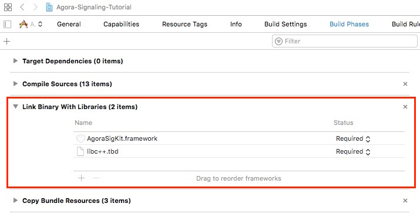
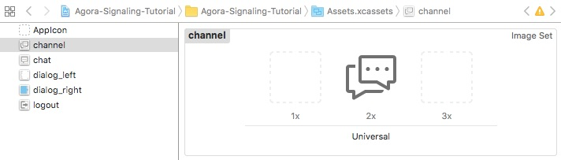
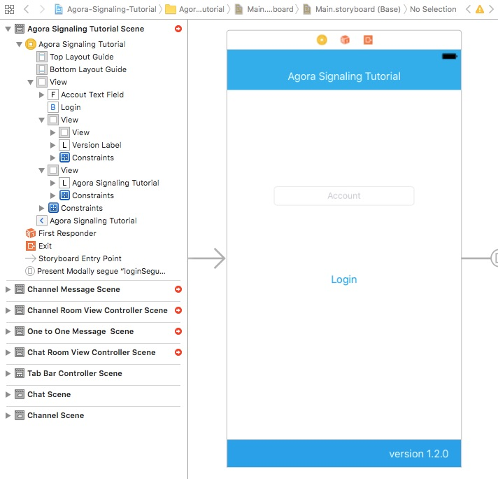
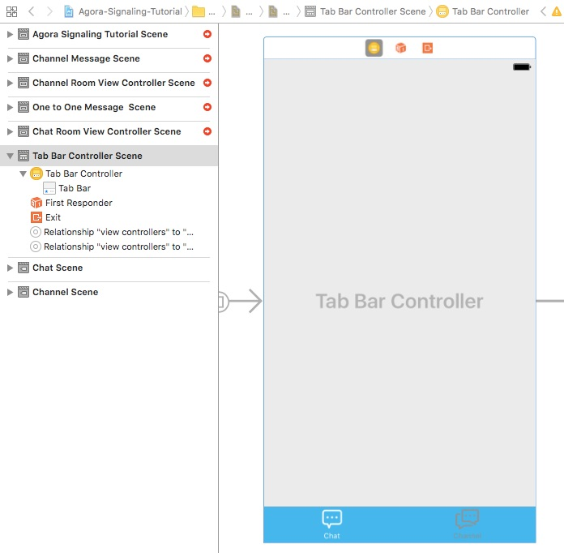
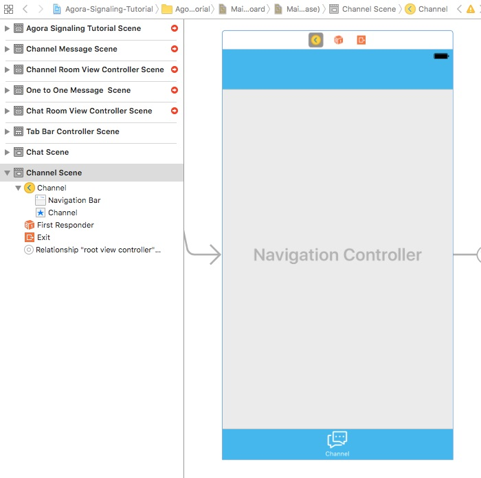
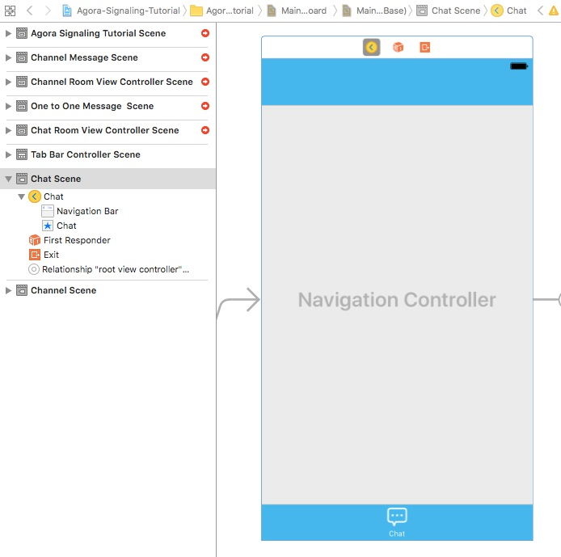
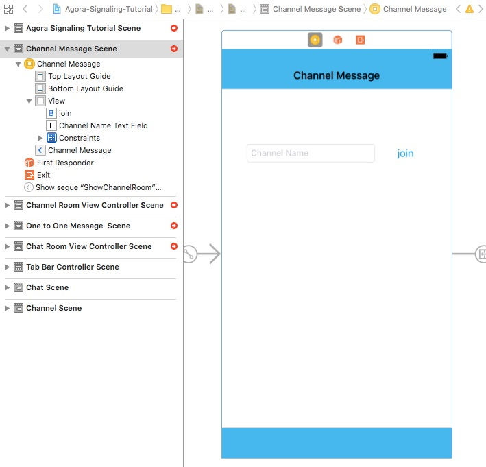
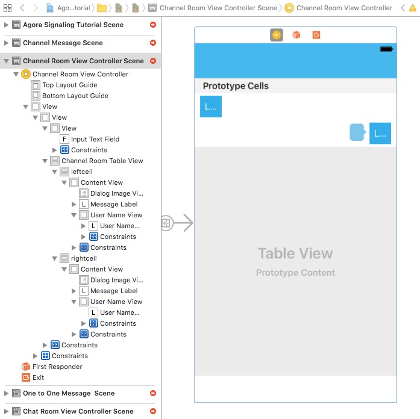
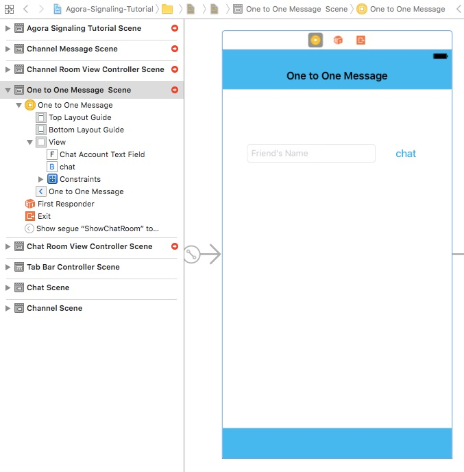
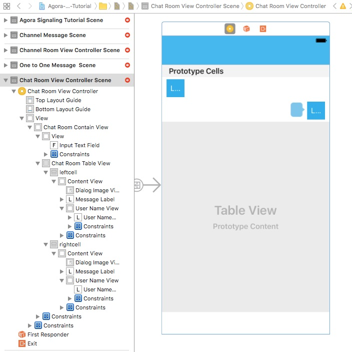

# Agora Signaling Tutorial (iOS Swift)


This tutorial enables you to quickly get started with using a sample chat application to develop requests to the Agora Signaling SDK.

This sample app demonstrates the basic Agora Signaling SDK features:

- Login to the signaling server
- Send and receive peer-to-peer messages offline
- View peer-to-peer message history
- Join a channel
- Send and receive channel messages
- Leave a channel
- Logout


## Prerequisites

- Xcode 9.0+
- Physical iOS device (iPhone or iPad)
	
	**Note:** Use a physical device to run the sample. Some simulators lack the functionality or the performance needed to run the sample.


## Quick Start
This section shows you how to prepare and build the Java signaling sample app.

### Create an Account and Obtain an App ID
To build and run the sample application, you must obtain an app ID: 

1. Create a developer account at [agora.io](https://dashboard.agora.io/signin/). Once you finish the sign-up process, you are redirected to the dashboard.
2. Navigate in the dashboard tree on the left to **Projects** > **Project List**.
3. Copy the app ID that you obtained from the dashboard into a text file. You will use this when you launch the app.


### Update and Run the Sample Application 

1. Open `Agora-Signaling-Tutorial.xcodeproj` and edit the `KeyCenter.swift` file. In the `AppId` declaration, update `<#Your App Id#>` with your app ID.

	``` Swift
    static let AppId: String = <#Your App Id#>
	```

2. Download the [Agora Signaling SDK](https://www.agora.io/en/download/). Unzip the downloaded SDK package and copy the `libs` folder from the SDK folder into the sample application's `Agora-Signaling-Tutorial` folder.
			
3. Connect your iPhone or iPad device and run the project. Ensure a valid provisioning profile is applied or your project will not run.


## Steps to Create the Sample 

- [Add Frameworks and Libraries](#add-frameworks-and-libraries)
- [Design the User Interface](#design-the-user-interface)
- [Create the MainViewController Class](#create-the-mainviewcontroller-class)
- [Create the ChannelViewController Class](#create-the-channelviewcontroller-class)
- [Create the ChannelRoomViewController Class](#create-the-channelroomviewcontroller-class)
- [Create the ChatViewController Class](#create-the-chatviewcontroller-class)
- [Create the ChatRoomViewController Class](#create-the-chatroomviewcontroller-class)


### Add Frameworks and Libraries

Under the **Build Phases** tab, add the following frameworks and libraries to your project:

- `AgoraSigKit.framework`
- `libc++.tbd`



### Design the User Interface

- [Add Assets](#add-assets)
- [Create the MainViewController UI](#create-the-mainviewcontroller-ui)
- [Create the TabBarControllerScene UI](#create-the-tabbarcontrollerscene-ui)
- [Create the Channel Screen UI Layouts](#create-the-channel-screen-ui-layouts)
- [Create the Chat Screen UI Layouts](#create-the-chat-screen-ui-layouts)


#### Add Assets

Add the following assets to `Assets.xcassets`.

**Note:** Use Xcode to import assets to `Assets.xcassets`. PDF files are used for these assets, which contain images for each iOS screen resolution.



Asset|Description
------|------
`channel`|An image of chat bubbles to navigate channels.
`chat`|An image of a speech bubble to start a chat.
`dialog_left` and `dialog_right`|Images of a speech bubble to contain speech for each user.
`btn_setting`|An image of an open square with an arrow pointing right, to logout of the application.

#### Create the MainViewController UI

Create the layout for the `MainViewController`.

**Note:** This layout includes a navigation `segue` to move from the login screen.



#### Create the TabBarControllerScene UI

Create the layout for the bottom tab bar, which acts as the application's main navigation.



This toggles between the channel and chat screens:

Channel Screen|Chat Screen
---|---
|

#### Create the Channel Screen UI Layouts

Create the layout for the `ChannelViewController`. This screen handles the login to a room specified by the **Account** text input box.

**Note:** This layout includes a navigation `segue` to move to the Channel Message Scene.



Create the layout for the Channel Message Scene, which maps to `ChannelRoomViewController`. This screen manages the channels the user has joined.




#### Create the Chat Screen UI Layouts

Create the layout for the `ChatViewController`. This screen allows the user to start a chat with the user specified by the **Friend's Name** text input box.

**Note:** This layout includes a navigation `segue` to move to the Chat Room Scene.



Create the layout for the Chat Room Scene, which maps to `ChatRoomViewController`. This screen manages the chat messages between the two users.




### Create the MainViewController Class

*MainViewController.swift* defines and connects application functionality with the [MainViewController UI](#create-the-mainviewcontroller-ui).

- [Define Global Variables](#define-global-variables)
- [Override Superclass Methods](#override-superclass-methods)
- [Add Login Method](#add-login-method)
- [Add Agora SDK Methods](#add-agora-sdk-methods)
- [Add Validation and Alert Methods](#add-validation-and-alert-methods)

#### Define Global Variables

The `MainViewController` class has two `IBOutlet` variables. These map to the [MainViewController UI](#create-the-mainviewcontroller-ui) elements.

Variable|Description
----|----
`accoutTextField`|Maps to the `UITextField` for the user's name in the `MainViewController` layout.
`versionLabel`|Maps to the `UILabel` for the version text in the `MainViewController` layout.

``` Swift
import UIKit
import AgoraSigKit

class MainViewController: UIViewController {
    
    @IBOutlet weak var accoutTextField: UITextField!
    @IBOutlet weak var versionLabel: UILabel!
    
    ...
}
```

#### Override Superclass Methods

The `viewDidLoad()` method triggers when the view loads. Set the `versionLabel` text with the Agora SDK version.

``` Swift
    override func viewDidLoad() {
        super.viewDidLoad()
        
        self.versionLabel.text = self.getSdkVersion()
    }
```

The `viewWillAppear()` method triggers when the view appears. Initialize the Agora SDK event listeners using `addAgoraSignalBlock()`.

``` Swift
    override func viewWillAppear(_ animated: Bool) {
        super.viewWillAppear(animated)
        
        addAgoraSignalBlock()
    }
```

The `touchesBegan()` method triggers when the user touches the screen. Stop keyboard editing functionality for the `view` using `view.endEditing()`.

``` Swift
    
    override func touchesBegan(_ touches: Set<UITouch>, with event: UIEvent?) {
        view.endEditing(true)
    }

```

#### Add Login Method

The `loginButtonClicked()` method is invoked when the login button is clicked.

1. Ensure `accoutTextField.text` is valid using `check()` before executing the rest of the method.
2. Login to the Agora Signaling SDK using `AgoraSignal.Kit.login2()` with the App ID `KeyCenter.AppId` and user's name `account`.
3. Initialize a `lastAccount` variable, retrieving the default `myAccount` value.
4. If `lastAccount` and `account` do not match:
	
	- Update the default `myAccount` value to `account` using `userDefault.set()`.
	- Remove all chat messages using `chatMessages.removeAll()`.

5. If `userColor[account]` has not been set, set the color to a random color using `UIColor.randomColor()`.


``` Swift
    @IBAction func loginButtonClicked(_ sender: UIButton) {
        guard let account = accoutTextField.text else {
            return
        }
        if !check(String: account) {
            return
        }
        
        AgoraSignal.Kit.login2(KeyCenter.AppId, account: account, token: "_no_need_token", uid: 0, deviceID: nil, retry_time_in_s: 60, retry_count: 5)
        
        let lastAccount = UserDefaults.standard.string(forKey: "myAccount")
        if lastAccount != account {
            let userDefault = UserDefaults.standard
            userDefault.set(account, forKey: "myAccount")
            chatMessages.removeAll()
        }
        
        if userColor[account] == nil {
            userColor[account] = UIColor.randomColor()
        }
    }
```

#### Add Agora SDK Methods

The `getSdkVersion()` retrieves the Agora SDK version.

1. Initialize `version` with `AgoraSignal.Kit.getSdkVersion()` casted to a `String`.
2. Remove the first two characters in `version` using `version.removeFirst()`.
3. Iterate through `version.enumerated()` and format the `version` text using `version.remove()` and `version.insert()`.
4. Return the `version` prepended by the text `Version `.

``` Swift
    func getSdkVersion() -> String {
        var version = String(AgoraSignal.Kit.getSdkVersion())
        for _ in 0 ..< 2 {
            version.removeFirst()
        }
        for (index, ch) in version.enumerated() {
            if index < 6 && index % 2 == 1 {
                if ch == "0" {
                    version.remove(at: version.index(version.startIndex, offsetBy: index))
                    version.insert(".", at: version.index(version.startIndex, offsetBy: index))
                }
            }
        }
        return "Version " + version
    }
```

The `addAgoraSignalBlock()` method adds event listeners for the Agora SDK.

``` Swift
    func addAgoraSignalBlock() {
        ...
    }
```

The `AgoraSignal.Kit.onLoginSuccess` triggers when a login succeeds.

Navigate to `loginSegue` using `self?.performSegue()`. Ensure this is executed on the main thread by wrapping it in `DispatchQueue.main.async()`.

``` Swift
        AgoraSignal.Kit.onLoginSuccess = { [weak self] (uid,fd) -> () in
            DispatchQueue.main.async(execute: {
                self?.performSegue(withIdentifier: "loginSegue", sender: self)
            })
        }
```

The `AgoraSignal.Kit.onLoginFailed` triggers when a login fails. Display an alert for the login failure using `self?.alert()`.

``` Swift
        AgoraSignal.Kit.onLoginFailed = { [weak self] (ecode) -> () in
            self?.alert(string: "Login failed with error: \(ecode.rawValue)")
        }
```

The `AgoraSignal.Kit.onLog` triggers when a log is added.

1. Ensure `txt` is valid before executing the remaining portion of the method.
2. Initialize `time` with the time stamp in the log.
3. Initialize `dformatter` for date formatting and `timeInterval` for the log `time`.
4. Initialize `date` with `timeInterval` and set the date formatting using `dformatter.dateFormat`.
5. Format the text for the `log` using `log.replaceSubrange`.
6. Save the `log` using `LogWriter.write()`.

``` Swift
        AgoraSignal.Kit.onLog = { (txt) -> () in
            guard var log = txt else {
                return
            }
            let time = log[..<log.index(log.startIndex, offsetBy: 10)]
            let dformatter = DateFormatter()
            let timeInterval = TimeInterval(Int(time)!)
            let date = Date(timeIntervalSince1970: timeInterval)
            dformatter.dateFormat = "yyyy-MM-dd HH:mm:ss"
            log.replaceSubrange(log.startIndex..<log.index(log.startIndex, offsetBy: 10), with: dformatter.string(from: date) + ".")
            
            LogWriter.write(log: log)
        }
```

The `AgoraSignal.Kit.onMessageInstantReceive` triggers when a message is received.

If there are no chat messages for the account:

1. Initialize `message` with the `account` and `msg`.
2. Initialize `messagelist` with an array of `Message` objects and append `message`.
3. Initialize `chatMsg` with a message list for the `account` and `messagelist` and set `chatMessages[account!]` to `chatMsg`.

Otherwise:

1. Initialize `message` with the `account` and `msg`.
2. Append `message` to the chat message list using `chatMessages[account!]?.list.append()`.

``` Swift
        AgoraSignal.Kit.onMessageInstantReceive = { (account, uid, msg) -> () in
            if chatMessages[account!] == nil {
                let message = Message(account: account, message: msg)
                var messagelist = [Message]()
                messagelist.append(message)
                let chatMsg = MessageList(identifier: account, list: messagelist)
                chatMessages[account!] = chatMsg
                return
            }
            let message = Message(account: account, message: msg)
            chatMessages[account!]?.list.append(message)
        }
```

#### Add Validation and Alert Methods

The `check()` method validates the account. If the `String` is invalid, display an alert using `alert()`. The following cases indicate an invalid `String`:

- The `String` is empty.
- The `String` length is greater than `128`
- The `String` contains a space

``` Swift
    func check(String: String) -> Bool {
        if String.isEmpty {
            alert(string: "The account is empty !")
            return false
        }
        if String.count > 128 {
            alert(string: "The accout is longer than 128 !")
            return false
        }
        if String.contains(" ") {
            alert(string: "The accout contains space !")
            return false
        }
        return true
    }
```

The `alert()` method displays an alert to the user.

Ensure `string` is not empty before executing the following:

1. Initialize `alert` with `string`
2. Add an `Ok` alert action to the `alert` using `alert.addAction()`.
3. Display the alert using `self.present()`.

**Note:** Ensure the alert code is executed on the main thread by wrapping it in `DispatchQueue.main.async()`.

``` Swift
    func alert(string: String) {
        guard !string.isEmpty else {
            return
        }
        
        DispatchQueue.main.async(execute: {
            let alert = UIAlertController(title: nil, message: string, preferredStyle: .alert)
            alert.addAction(UIAlertAction(title: "Ok", style: .cancel, handler: nil))
            self.present(alert, animated: true, completion: nil)
        })
    }
```


### Create the ChannelViewController Class

*ChannelViewController.swift* defines and connects application functionality with the [ChannelViewController UI](#create-the-channel-screen-ui-layouts).

- [Add Global Variables and Initialization and Navigation Methods](#add-global-variables-and-initialization-and-navigation-methods)
- [Add Agora Join and Logout Functionality](#add-agora-join-and-logout-functionality)
- [Add ChannelViewController Extension](#add-channelviewcontroller-extension)


#### Add Global Variables and Initialization and Navigation Methods

The `ChannelViewController` class has one `IBOutlet` variable. The `channelNameTextField` maps to the [ChannelViewController UI](#create-the-channel-screen-ui-layouts) `UITextField` element for the channel name.

``` Swift
import UIKit

class ChannelViewController: UIViewController {
    @IBOutlet weak var channelNameTextField: UITextField!
    
    ...
}
```

The `viewDidLoad()` method triggers when the view loads.

- Initialize back bar button navigation `self.navigationItem.backBarButtonItem` to an empty button.
- Initialize right bar button navigation `self.navigationItem.rightBarButtonItem` to a `logout` button.

``` Swift
    override func viewDidLoad() {
        super.viewDidLoad()

        self.navigationItem.backBarButtonItem = UIBarButtonItem(title: "", style: .plain, target: nil, action: nil)
        self.navigationItem.rightBarButtonItem = UIBarButtonItem(image: #imageLiteral(resourceName: "logout"), style: .plain, target: self, action: #selector(logout))
    }
```

The `viewWillAppear()` method triggers when the view appears. Initialize the Agora SDK event listeners using `addAgoraSignalBlock()`.

``` Swift
    override func viewWillAppear(_ animated: Bool) {
        super.viewWillAppear(animated)
        
        addAgoraSignalBlock()
    }
```

The `prepare()` method is triggered by a `UIStoryboardSegue`.

Initialize `channelRoomCV` with `segue.destination` and  `channelName` with `sender`. If `channelRoomCV` and `channelName` are valid, set the `channelRoomCV.channelName` to `channelName`.

``` Swift
    override func prepare(for segue: UIStoryboardSegue, sender: Any?) {
        if let channelRoomCV = segue.destination as? ChannelRoomViewController, let channelName = sender as? String {
            channelRoomCV.channelName = channelName
        }
    }
```

#### Add Agora Join and Logout Functionality

The `addAgoraSignalBlock()` method adds event listeners for the Agora SDK.

``` Swift
    func addAgoraSignalBlock() {
        
        ...
    }
```

The `AgoraSignal.Kit.onChannelJoined` triggers when a channel is joined.

Navigate to the channel room specified by `self.channelNameTextField.text` using `self.performSegue()`. Ensure  this is called on the main thread by wrapping it in `DispatchQueue.main.async()`.

``` Swift
        AgoraSignal.Kit.onChannelJoined = { (channelID) -> () in
            DispatchQueue.main.async(execute: {
                self.performSegue(withIdentifier: "ShowChannelRoom", sender: self.channelNameTextField.text)
            })
        }
```

The `AgoraSignal.Kit.onChannelJoinFailed` triggers when joining a channel fails. Display an alert for the failure using `self.alert()`.

``` Swift
        AgoraSignal.Kit.onChannelJoinFailed = { (channelID, ecode) -> () in
            self.alert(string: "Join channel failed with error: \(ecode.rawValue)")
        }
```

The `logout()` method logs the user out of the Agora Signaling SDK using `AgoraSignal.Kit.logout()`.

``` Swift
    @objc func logout() {
        AgoraSignal.Kit.logout()
    }
```

The `joinButtonClicked()` IBAction method is mapped to the **Join** button and joins the user to the channel.

1. Ensure the `channelNameTextField.text` is valid and validate `channelName` using `check()`.
2. Join the channel `channelName` using `AgoraSignal.Kit.channelJoin()`.

``` Swift
    @IBAction func joinButtonClicked(_ sender: UIButton) {
        
        guard let channelName = channelNameTextField.text else {
            return
        }
        if !check(String: channelName) {
            return
        }
        AgoraSignal.Kit.channelJoin(channelName)
    }
```

The `touchesBegan()` method triggers when the user touches the screen. Stop keyboard editing functionality for the `view` using `view.endEditing()`.

``` Swift
    override func touchesBegan(_ touches: Set<UITouch>, with event: UIEvent?) {
        view.endEditing(true)
    }
```

#### Add ChannelViewController Extension

The `check()` and `alert()` methods for ChannelViewController are contained within an extension.

``` Swift

extension ChannelViewController {
    ...
}

```

The `check()` method validates the account. If the `String` is invalid, display an alert using `alert()`. The following cases indicate an invalid `String`:

- The `String` is empty.
- The `String` length is greater than `128`
- The `String` contains a space

``` Swift
    func check(String: String) -> Bool {
        if String.isEmpty {
            alert(string: "The channel name is empty !")
            return false
        }
        if String.count > 128 {
            alert(string: "The channel name is too long !")
            return false
        }
        return true
    }
```

The `alert()` method displays an alert to the user.

Ensure `string` is not empty before executing the following:

1. Initialize `alert` with `string`
2. Add an `Ok` alert action to the `alert` using `alert.addAction()`.
3. Display the alert using `self.present()`.

**Note:** Ensure the alert code is executed on the main thread by wrapping it in `DispatchQueue.main.async()`.

``` Swift
    func alert(string: String) {
        guard !string.isEmpty else {
            return
        }
        
        DispatchQueue.main.async(execute: {
            let alert = UIAlertController(title: nil, message: string, preferredStyle: .alert)
            alert.addAction(UIAlertAction(title: "Ok", style: .cancel, handler: nil))
            self.present(alert, animated: true, completion: nil)
        })
    }
```

### Create the ChannelRoomViewController Class

*ChannelRoomViewController.swift* defines and connects application functionality with the [ChannelRoomViewController UI](#create-the-channel-screen-ui-layouts).

- [Add Global Variables](#add-global-variables)
- [Add Initialization Methods](#add-initialization-methods)
- [Add Agora Messaging Functionality](#add-agora-messaging-functionality)
- [Create the ChannelRoomViewController Base Extension](#create-the-channelroomviewcontroller-base-extension)
- [Create the ChannelRoomViewController UITextFieldDelegate Extension](#create-the-channelroomviewcontroller-uitextfielddelegate-extension)

#### Add Global Variables

The `ChannelRoomViewController` class has three `IBOutlet` variables. These variables map to the [ChannelRoomViewController UI](#create-the-channel-screen-ui-layouts) elements.

Variable|Description
----|----
`channelRoomTableView`|Maps to the `UITableView` for the list of channel names in the `ChannelRoomViewController` layout.
`channelRoomContainBottom`|Maps to the `NSLayoutConstraint` for the constraint in the `ChannelRoomViewController` layout.
`inputTextField`|Maps to the `UITextField` for the message text in the `ChannelRoomViewController` layout.

``` Swift
import UIKit

class ChannelRoomViewController: UIViewController {
    @IBOutlet weak var channelRoomTableView: UITableView!
    @IBOutlet weak var channelRoomContainBottom: NSLayoutConstraint!
    @IBOutlet weak var inputTextField: UITextField!
    
    ...
    
}
```

The `ChannelRoomViewController` class has three global variables:

Variable|Description
----|----
`channelName`|String for the channel name.
`messageList`|List of messages.
`userNum`|Number of users. **Note:** When `userNum` is set, update the title with the `self.channelName` and `self.userNum`. Ensure this is executed on the main thread by wrapping it in `DispatchQueue.main.async()`.

``` Swift    
    var channelName: String!
    
    var messageList = MessageList()
    
    var userNum = 0 {
        didSet {
            DispatchQueue.main.async(execute: {
                self.title = self.channelName + " (\(String(self.userNum)))"
            })
        }
    }
```

#### Add Initialization Methods

The `viewDidLoad()` method triggers when the view loads.

1. Set the `self.channelRoomTableView` row height to auto resize using `UITableView.automaticDimension`.
2. Set the `self.channelRoomTableView` estimated row height to `50`.
3. Query `channelName` in the Agora Signaling SDK using `AgoraSignal.Kit.channelQueryUserNum()`.
4. Set `messageList.identifier` to `channelName`.
5. Add keyboard observer using `addKeyboardObserver()`.
6. Add touch functionality to `self.channelRoomTableView` using `addTouchEventToTableView()`.  

``` Swift
    override func viewDidLoad() {
        super.viewDidLoad()
        
        self.channelRoomTableView.rowHeight = UITableView.automaticDimension
        self.channelRoomTableView.estimatedRowHeight = 50
        
        AgoraSignal.Kit.channelQueryUserNum(channelName)
        
        messageList.identifier = channelName
        
        addKeyboardObserver()
        addTouchEventToTableView(self.channelRoomTableView)
    }
```

The `viewWillAppear()` method triggers when the view appears. Initialize the Agora SDK event listeners using `addAgoraSignalBlock()`.

``` Swift    
    override func viewWillAppear(_ animated: Bool) {
        super.viewWillAppear(animated)
        
        addAgoraSignalBlock()
    }
```

The `viewDidDisappear()` method triggers when the view disappears. Leave the `channelName` using `AgoraSignal.Kit.channelLeave()`.

``` Swift    
    override func viewDidDisappear(_ animated: Bool) {
        super.viewDidDisappear(animated)
        
        AgoraSignal.Kit.channelLeave(channelName)
    }
```

#### Add Agora Messaging Functionality

The `addAgoraSignalBlock()` method adds event listeners for the Agora SDK.

``` Swift
    func addAgoraSignalBlock() {
        ...
    }
```

The `AgoraSignal.Kit.onMessageSendError` event listener triggers when an error occurs while sending a message. Display an alert of the error using `self?.alert()`.

``` Swift
        AgoraSignal.Kit.onMessageSendError = { [weak self] (messageID, ecode) -> () in
            self?.alert(string: "Message send failed with error: \(ecode.rawValue)")
        }
```

The `AgoraSignal.Kit.onMessageChannelReceive` event listener triggers when a channel message is received. Ensure the following code is executed on the main thread using `DispatchQueue.main.async()`:

1. Initialize a `Message` object with the `account` and `msg`.
2. Append `message` to the message list using `self?.messageList.list.append()`.
3. Update the `self?.channelRoomTableView` table view using `self?.updateTableView()`.
4. Set `self?.inputTextField.text` to an empty string.

``` Swift
        AgoraSignal.Kit.onMessageChannelReceive = { [weak self] (channelID, account, uid, msg) -> () in
            DispatchQueue.main.async(execute: {
                let message = Message(account: account, message: msg)
                self?.messageList.list.append(message)
                self?.updateTableView((self?.channelRoomTableView)!, with: message)
                self?.inputTextField.text = ""
            })
        }
```

The `AgoraSignal.Kit.onChannelQueryUserNumResult`, `AgoraSignal.Kit.onChannelUserJoined`, and `AgoraSignal.Kit.onChannelUserJoined` event listeners updates `self?.userNum`:

Listener|Description
---|---
`onChannelQueryUserNumResult`|Triggers when the user number query result is complete. Updates `self?.userNum` to `num`. 
`onChannelUserJoined`|Triggers when the user joins a channel. Increments `self?.userNum` by `1`. 
`onChannelUserLeaved`|Triggers when the user leaves the channel. Decrements `self?.userNum` by `1`.

``` Swift
        AgoraSignal.Kit.onChannelQueryUserNumResult = { [weak self] (channelID, ecode, num) -> () in
            self?.userNum = Int(num)
        }

        AgoraSignal.Kit.onChannelUserJoined = { [weak self] (account, uid) -> () in
            self?.userNum += 1
        }
        
        AgoraSignal.Kit.onChannelUserLeaved = { [weak self] (account, uid) -> () in
            self?.userNum -= 1
        }
```


#### Create the ChannelRoomViewController Base Extension

``` Swift
private extension ChannelRoomViewController {
    ...    
}
```

The `alert()` method displays an alert to the user.

Ensure `string` is not empty before executing the following:

1. Initialize `alert` with `string`
2. Add an `Ok` alert action to the `alert` using `alert.addAction()`.
3. Display the alert using `self.present()`.

**Note:** Ensure the alert code is executed on the main thread by wrapping it in `DispatchQueue.main.async()`.

``` Swift
    func alert(string: String) {
        guard !string.isEmpty else {
            return
        }
        
        DispatchQueue.main.async(execute: {
            let alert = UIAlertController(title: nil, message: string, preferredStyle: .alert)
            alert.addAction(UIAlertAction(title: "Ok", style: .cancel, handler: nil))
            self.present(alert, animated: true, completion: nil)
        })
    }
```

The `updateTableView()` method updates the specified `tableView` with the new `message`.

1. Retrieve the `IndexPath` of the last row in `tableView`.
2. Start the updates using `tableView.beginUpdates()`, insert a new row at the end using `tableView.insertRows`, and end the updates using `tableView.endUpdates()`.
3. Bring the last message into view using `tableView.scrollToRow()`.

``` Swift
    func updateTableView(_ tableView: UITableView, with message: Message) {
        let insterIndexPath = IndexPath(row: tableView.numberOfRows(inSection: 0), section: 0)
        tableView.beginUpdates()
        tableView.insertRows(at: [insterIndexPath], with: .none)
        tableView.endUpdates()
        tableView.scrollToRow(at: insterIndexPath, at: .bottom, animated: false)
    }
```

The `addTouchEventToTableView()` method listens for a tap gesture on the specified `tableView`.

1. Initialize a new `UITapGestureRecognizer` object that will trigger the `tableViewTouchInSide` method.
2. Set the gesture's number of taps to `1` and the `cancelsTouchesInView` to `false`.
3. Connect `tableViewGesture` to `tableView` using `tableView.addGestureRecognizer()`.
4. Set the keyboard dismissal mode for `tableView` to `.onDrag`.

``` Swift
    func addTouchEventToTableView(_ tableView: UITableView) {
        let tableViewGesture = UITapGestureRecognizer(target: self, action: #selector(tableViewTouchInSide))
        tableViewGesture.numberOfTapsRequired = 1
        tableViewGesture.cancelsTouchesInView = false
        tableView.addGestureRecognizer(tableViewGesture)
        tableView.keyboardDismissMode = .onDrag
    }
```

The `tableViewTouchInSide()` method dismisses the keyboard for the text input field using `inputTextField.resignFirstResponder()`.

``` Swift
    @objc func tableViewTouchInSide() {
        inputTextField.resignFirstResponder()
    }
```

The `addKeyboardObserver()` method sets keyboard event listeners.

``` Swift    
    func addKeyboardObserver() {
        ... 
    }    
```

The `UIResponder.keyboardWillShowNotification` event listener triggers when the keyboard displays.

Ensure the following are valid before executing the remaining event listener code:

- `self`
- `userInfo` property for `notify`
- `UIResponder.keyboardFrameEndUserInfoKey` for `userInfo`
- `UIResponder.keyboardAnimationDurationUserInfoKey` for `userInfo`

``` Swift    
        NotificationCenter.default.addObserver(forName: UIResponder.keyboardWillShowNotification, object: nil, queue: nil) { [weak self] notify in
            guard let strongSelf = self, let userInfo = (notify as NSNotification).userInfo,
                let keyBoardBoundsValue = userInfo[UIResponder.keyboardFrameEndUserInfoKey] as? NSValue,
                let durationValue = userInfo[UIResponder.keyboardAnimationDurationUserInfoKey] as? NSNumber else {
                    return
            }
            
            ...
            
        }
```

1. Initialize variables for `keyBoardBoundsValue.cgRectValue`, `durationValue.doubleValue`, and `keyBoardBounds.size.height`.
2. If `duration` is greater than `0` execute the following, otherwise set `strongSelf.channelRoomContainBottom.constant` to `deltaY`:

	1. Initialize `optionsInt` to `0`.
	2. Ensure `userInfo[UIResponder.keyboardAnimationCurveUserInfoKey]` is valid and set `optionsInt` to `optionsValue`.
	3. Initialize `options` using `UIView.AnimationOptions()`.
	4. Animate the view elements using `UIView.animate()`, updating `strongSelf.channelRoomContainBottom.constant` to `deltaY`.

``` Swift            
            let keyBoardBounds = keyBoardBoundsValue.cgRectValue
            let duration = durationValue.doubleValue
            let deltaY = keyBoardBounds.size.height
            
            if duration > 0 {
                var optionsInt: UInt = 0
                if let optionsValue = userInfo[UIResponder.keyboardAnimationCurveUserInfoKey] as? NSNumber {
                    optionsInt = optionsValue.uintValue
                }
                let options = UIView.AnimationOptions(rawValue: optionsInt)
                
                UIView.animate(withDuration: duration, delay: 0, options: options, animations: {
                    strongSelf.channelRoomContainBottom.constant = deltaY
                    strongSelf.view?.layoutIfNeeded()
                }, completion: nil)
                
            } else {
                strongSelf.channelRoomContainBottom.constant = deltaY
            }
```

If the message list has more than `0` messages:

1. Retrieve the `IndexPath` of last row in the list.
2. Ensure the last message is in view using `strongSelf.channelRoomTableView.scrollToRow()`.

``` Swift            
            if strongSelf.messageList.list.count > 0 {
                let insterIndexPath = IndexPath(row: strongSelf.messageList.list.count - 1, section: 0)
                strongSelf.channelRoomTableView.scrollToRow(at: insterIndexPath, at: .bottom, animated: false)
            }
```

The `UIResponder.keyboardWillHideNotification` event listener triggers when the keyboard hides.

Ensure the `self` is valid before executing the remaining event listener code.

``` Swift    
        NotificationCenter.default.addObserver(forName: UIResponder.keyboardWillHideNotification, object: nil, queue: nil) { [weak self] notify in
            guard let strongSelf = self else {
                return
            }
            ...
        }
```

1. Declare a `duration` variable.
2. If `userInfo` for `notify` and `UIResponder.keyboardAnimationDurationUserInfoKey` for `userInfo` is valid. If valid, set `duration` to `durationValue.doubleValue`. Otherwise set `duration` to `0`.
3. If `duration` is greater than `0` execute the following, otherwise set `strongSelf.channelRoomContainBottom.constant` to `0`:

	1. Initialize `optionsInt` to `0`.
	2. Ensure `userInfo[UIResponder.keyboardAnimationCurveUserInfoKey]` is valid and set `optionsInt` to `optionsValue.uintValue`.
	3. Initialize `options` using `UIView.AnimationOptions()`.
	4. Animate the view elements using `UIView.animate()`, updating `strongSelf.channelRoomContainBottom.constant` to `0`.

``` Swift    
            let duration: Double
            if let userInfo = (notify as NSNotification).userInfo, let durationValue = userInfo[UIResponder.keyboardAnimationDurationUserInfoKey] as? NSNumber {
                duration = durationValue.doubleValue
            } else {
                duration = 0
            }
            
            if duration > 0 {
                var optionsInt: UInt = 0
                if let userInfo = (notify as NSNotification).userInfo, let optionsValue = userInfo[UIResponder.keyboardAnimationCurveUserInfoKey] as? NSNumber {
                    optionsInt = optionsValue.uintValue
                }
                let options = UIView.AnimationOptions(rawValue: optionsInt)
                
                UIView.animate(withDuration: duration, delay: 0, options: options, animations: {
                    strongSelf.channelRoomContainBottom.constant = 0
                    strongSelf.view?.layoutIfNeeded()
                }, completion: nil)
                
            } else {
                strongSelf.channelRoomContainBottom.constant = 0
            }
```

#### Create the ChannelRoomViewController UITextFieldDelegate Extension

The `UITextFieldDelegate` extension applies to the `UITextField` elements.

The `textFieldShouldReturn` method triggers when the user presses the **Return** button on the keyboard. Ensure `inputTextField.text` is valid before executing the remaining code in the method.

Send `message` to `channelName` using `AgoraSignal.Kit.messageChannelSend()`.

``` Swift
extension ChannelRoomViewController: UITextFieldDelegate {
    func textFieldShouldReturn(_ textField: UITextField) -> Bool {
        guard let message = inputTextField.text else { return false }
        
        AgoraSignal.Kit.messageChannelSend(channelName, msg: message, msgID: String(messageList.list.count))
        
        return true
    }
}
```

The `UITableViewDataSource` and `UITableViewDelegate` extension applies to the `UITableView` elements.

``` Swift
extension ChannelRoomViewController: UITableViewDataSource, UITableViewDelegate {
    
    ...
    
}
```

The `numberOfRowsInSection` method returns the total number of messages `messageList.list.count`.

``` Swift
    func tableView(_ tableView: UITableView, numberOfRowsInSection section: Int) -> Int {
        return messageList.list.count
    }
```

The `cellForRowAt` method returns table cell for the specified `indexPath`.

Retrieve the `myAccount` default value.

If `messageList.list[indexPath.row].account` and `myAccount` do not match:
	
1. Set `userColor[messageList.list[indexPath.row].account]` to a random color if it is `nil`.
2. Retrieve the table cell renderer as a `LeftCell` using `tableView.dequeueReusableCell()`.
3. Set the message for the cell using `cell.setCellViewWith()`.

If `messageList.list[indexPath.row].account` and `myAccount` do match:

1. Retrieve the table cell renderer as a `RightCell` using `tableView.dequeueReusableCell()`.
2. Set the message for the cell using `cell.setCellViewWith()`.

``` Swift
    func tableView(_ tableView: UITableView, cellForRowAt indexPath: IndexPath) -> UITableViewCell {
        let myAccount = UserDefaults.standard.string(forKey: "myAccount")
        if messageList.list[indexPath.row].account != myAccount {
            if userColor[messageList.list[indexPath.row].account] == nil {
                userColor[messageList.list[indexPath.row].account] = UIColor.randomColor()
            }
            let cell = tableView.dequeueReusableCell(withIdentifier: "leftcell", for: indexPath) as! LeftCell
            cell.setCellViewWith(message: messageList.list[indexPath.row])
            return cell
        }
        
        let cell = tableView.dequeueReusableCell(withIdentifier: "rightcell", for: indexPath) as! RightCell
        cell.setCellViewWith(message: messageList.list[indexPath.row])
        return cell
    }
```

### Create the ChatViewController Class

*ChatViewController.swift* defines and connects application functionality with the [ChatViewController UI](#create-the-chat-screen-ui-layouts).

- [Add Global Variable and Initialization Methods](#add-global-variable-and-initialization-methods)
- [Add Navigation and Touch Functionality](#add-navigation-and-touch-functionality)
- [Add Logout and Agora Message Receipt Functionality](#add-logout-and-agora-message-receipt-functionality)
- [Create ChatViewController Extension](#create-chatviewcontroller-extension)

#### Add Global Variable and Initialization Methods


The `ChatViewController` class has one `IBOutlet` variable. The `chatAccountTextField` variable maps to the [ChatViewController UI](#create-the-chat-screen-ui-layouts) account text field.

``` Swift
import UIKit

class ChatViewController: UIViewController {
    @IBOutlet weak var chatAccountTextField: UITextField!
    
    ...
    
}    
```

The `viewDidLoad()` method triggers when the view loads.

- Initialize back bar button navigation `self.navigationItem.backBarButtonItem` to an empty button.
- Initialize right bar button navigation `self.navigationItem.rightBarButtonItem` to a `logout` button.


``` Swift    
    override func viewDidLoad() {
        super.viewDidLoad()
        
        self.navigationItem.backBarButtonItem = UIBarButtonItem(title: "", style: .plain, target: nil, action: nil)
        self.navigationItem.rightBarButtonItem = UIBarButtonItem(image: #imageLiteral(resourceName: "logout"), style: .plain, target: self, action: #selector(logout))
    }
```

The `viewWillAppear()` method triggers when the view appears. Initialize the Agora SDK event listeners using `addAgoraSignalBlock()`.

``` Swift
    override func viewWillAppear(_ animated: Bool) {
        super.viewWillAppear(animated)
        
        addAgoraSignalBlock()
    }
```

#### Add Navigation and Touch Functionality

The `chatButtonClicked()` IBAction method is invoked by pressing the chat button.

1. Ensure `chatAccountTextField.text` is valid and validate `chatAccount` using `check()`.
2. Navigate to the chat room using `self.performSegue()`.

``` Swift
    @IBAction func chatButtonClicked(_ sender: UIButton) {
        guard let chatAccount = chatAccountTextField.text else {
            return
        }
        if !check(String: chatAccount) {
            return
        }
        self.performSegue(withIdentifier: "ShowChatRoom", sender: chatAccount)
    }
```

The `touchesBegan()` method triggers when the user touches the screen. Stop keyboard editing functionality for the `view` using `view.endEditing()`.

``` Swift
    override func touchesBegan(_ touches: Set<UITouch>, with event: UIEvent?) {
        view.endEditing(true)
    }
```

The `prepare()` method is triggered by a `UIStoryboardSegue`.

Initialize `chatRoomVC` with `segue.destination` and `account` with `sender`. Set the `chatRoomVC.account` to `account`.

If there are no `chatMessages` for `chatRoomVC.account`, set `chatRoomVC.messageList` to `chatMessages[chatRoomVC.account]`.

Otherwise set `chatRoomVC.messageList.identifier` to `chatRoomVC.account`.

``` Swift
    override func prepare(for segue: UIStoryboardSegue, sender: Any?) {
        if let chatRoomVC = segue.destination as? ChatRoomViewController, let account = sender as? String {
            chatRoomVC.account = account
            if chatMessages[chatRoomVC.account] != nil {
                chatRoomVC.messageList = chatMessages[chatRoomVC.account]!
            } else {
                chatRoomVC.messageList.identifier = chatRoomVC.account
            }
        }
    }
```

#### Add Logout and Agora Message Receipt Functionality

The `logout()` method logs the user out of the Agora Signaling SDK using `AgoraSignal.Kit.logout()`.

``` Swift
    @objc func logout() {
        AgoraSignal.Kit.logout()
    }
```

The `addAgoraSignalBlock()` method adds event listeners for the Agora SDK.

``` Swift
    func addAgoraSignalBlock() {
        ...
    }
```

The `AgoraSignal.Kit.onLogout` triggers when the user logs out. Dismiss the view using `self?.dismiss()` on the main thread by wrapping it in `DispatchQueue.main.async()`.

``` Swift
        AgoraSignal.Kit.onLogout = { [weak self] (ecode) -> () in
            DispatchQueue.main.async(execute: {
                self?.dismiss(animated: true, completion: nil)
            })
        }
```

The `AgoraSignal.Kit.onMessageInstantReceive` triggers when a message is received.

If there are no chat messages for the account:

1. Initialize `message` with the `account` and `msg`.
2. Initialize `messagelist` with an array of `Message` objects and append `message`.
3. Initialize `chatMsg` with a message list for the `account` and `messagelist` and set `chatMessages[account!]` to `chatMsg`.

Otherwise:

1. Initialize `message` with the `account` and `msg`.
2. Append `message` to the chat message list using `chatMessages[account!]?.list.append()`.

``` Swift
        AgoraSignal.Kit.onMessageInstantReceive = { (account, uid, msg) -> () in
            if chatMessages[account!] == nil {
                let message = Message(account: account, message: msg)
                var messagelist = [Message]()
                messagelist.append(message)
                let chatMsg = MessageList(identifier: account, list: messagelist)
                chatMessages[account!] = chatMsg
                return
            }
            let message = Message(account: account, message: msg)
            chatMessages[account!]?.list.append(message)
        }
```

#### Create ChatViewController Extension

The `check()` method validates the account. If the `String` is invalid, display an alert using `alert()`. The following cases indicate an invalid `String`:

- The `String` is empty.
- The `String` length is greater than `128`
- The `String` contains a space

``` Swift
extension ChatViewController {
    func check(String: String) -> Bool {
        if String.isEmpty {
            alert(string: "The account is empty !")
            return false
        }
        if String.count > 128 {
            alert(string: "The accout is longer than 128 !")
            return false
        }
        if String.contains(" ") {
            alert(string: "The accout contains space !")
            return false
        }
        return true
    }
    
    ...

}    
```

The `alert()` method displays an alert to the user.

Ensure `string` is not empty before executing the following:

1. Initialize `alert` with `string`
2. Add an `Ok` alert action to the `alert` using `alert.addAction()`.
3. Display the alert using `self.present()`.

**Note:** Ensure the alert code is executed on the main thread by wrapping it in `DispatchQueue.main.async()`.

``` Swift
    
    func alert(string: String) {
        guard !string.isEmpty else {
            return
        }
        
        DispatchQueue.main.async(execute: {
            let alert = UIAlertController(title: nil, message: string, preferredStyle: .alert)
            alert.addAction(UIAlertAction(title: "Ok", style: .cancel, handler: nil))
            self.present(alert, animated: true, completion: nil)
        })
    }
```
### Create the ChatRoomViewController Class

*ChatRoomViewController.swift* defines and connects application functionality with the [ChatRoomViewController UI](#create-the-chat-screen-ui-layouts).

- [Add IBOutlet and Global Variables](#add-iboutlet-and-global-variables)
- [Add ChatRoomViewController Initialization Methods](#add-chatroomviewcontroller-initialization-methods)
- [Add Agora User Status Functionality](#add-agora-user-status-functionality)
- [Create ChatRoomViewController Base Extension](#create-chatroomviewcontroller-base-extension)
- [Create the ChatRoomViewController UITextField and UITableView Extensions](#create-the-chatroomviewcontroller-uitextfield-and-uitableview-extensions)

#### Add IBOutlet and Global Variables

The `ChatRoomViewController` class has four `IBOutlet` variables. These variables map to the [ChatRoomViewController UI](#create-the-chat-screen-ui-layouts) elements.

Variable|Description
----|----
`chatRoomContainView`|Maps to the `UIView` for the chat room in the `ChatRoomViewController` layout.
`chatRoomContainBottom`|Maps to the `NSLayoutConstraint` for the constraint in the `ChatRoomViewController` layout.
`chatRoomTableView`|Maps to the `UITableView` for the chat room list in the `ChatRoomViewController ` layout.
`inputTextField`|Maps to the `UITextField` for the message text in the `ChatRoomViewController` layout.

``` Swift
import UIKit

class ChatRoomViewController: UIViewController {
    @IBOutlet weak var chatRoomContainView: UIView!
    @IBOutlet weak var chatRoomContainBottom: NSLayoutConstraint!
    @IBOutlet weak var chatRoomTableView: UITableView!
    @IBOutlet weak var inputTextField: UITextField!
    
    ...
    
}
```

The `ChatRoomViewController` class has four global variables.

Variable|Description
----|----
`account`|String for the user account.
`isFirstLoad`|Determines if this is the first load.
`timer`|Timer for the session.
`isOnline`|Determines if the user is online.

When `isOnline` is set, update `self.title` with the account name and online status. Ensure this is executed on the main thread by wrapping it in `DispatchQueue.main.async()`.

``` Swift
    var account: String!
    var isFirstLoad = true
    var timer: Timer!
    
    var isOnline = false {
        didSet {
            DispatchQueue.main.async(execute: {
                self.title = self.account + " (" + (self.isOnline ? "online" : "offline") + ")"
            })
        }
    }
    
    var messageList = MessageList()
```

#### Add ChatRoomViewController Initialization Methods

The `viewDidLoad()` method triggers when the view loads.

1. Set the `self.chatRoomTableView` row height to auto resize using `UITableView.automaticDimension`.
2. Set the `self.chatRoomTableView` estimated row height to `50`.
3. Check the user status on the Agora Signaling SDK using `checkStatus()`.
4. Initialize a timer using `Timer.scheduledTimer()` to run `checkStatus` every `2` seconds.
5. Add touch functionality to `self.chatRoomTableView` using `addTouchEventToTableView()`.  
6. Add keyboard observer using `addKeyboardObserver()`.

``` Swift
    override func viewDidLoad() {
        super.viewDidLoad()
        
        self.chatRoomTableView.rowHeight = UITableView.automaticDimension
        self.chatRoomTableView.estimatedRowHeight = 50

        checkStatus()
        timer = Timer.scheduledTimer(timeInterval: 2, target: self, selector: #selector(checkStatus), userInfo: nil, repeats: true)
    
        addTouchEventToTableView(self.chatRoomTableView)
        addKeyboardObserver()
    }
```

The `viewWillAppear()` method triggers when the view appears. Initialize the Agora SDK event listeners using `addAgoraSignalBlock()`.

``` Swift
    override func viewWillAppear(_ animated: Bool) {
        super.viewWillAppear(animated)
      
        addAgoraSignalBlock()
    }
```

The `viewDidAppear()` method triggers when the view appears.

1. Ensure `messageList.list.count` is not equal to `0` before executing the remaining code in this method.
2. Retrieve the `IndexPath` of the last message in the list.
3. Ensure the last message is in view using `self.chatRoomTableView.scrollToRow()`.

``` Swift
    override func viewDidAppear(_ animated: Bool) {
        if messageList.list.count == 0 {
            return
        }
        let insterIndexPath = IndexPath(row: self.messageList.list.count - 1, section: 0)
        self.chatRoomTableView.scrollToRow(at: insterIndexPath, at: .bottom, animated: false)
    }
```

The `viewWillDisappear()` method triggers before the view disappears.

Set `chatMessages[account]` to `messageList` and invalidate the timer using `timer?.invalidate()`.

``` Swift
    override func viewWillDisappear(_ animated: Bool) {
        super .viewWillDisappear(animated)

        chatMessages[account] = messageList
        timer?.invalidate()
    }
```

#### Add Agora User Status Functionality

The `addAgoraSignalBlock()` method adds event listeners for the Agora SDK.

``` Swift
    func addAgoraSignalBlock() {
        
        ...
        
    }
    
```

The `AgoraSignal.Kit.onQueryUserStatusResult` event listener triggers when a user's status query result completes:

- If this is the first load, update the online status using `self?.isOnline` and set `self?.isFirstLoad` to `false`.
- If the `status` is `1`. Check if the user not online and set `self?.isOnline` to `true`.
- Otherwise, if the he `status` is not `1` and user is offline, set `self?.isOnline` to `false`.

``` Swift                
        AgoraSignal.Kit.onQueryUserStatusResult = { [weak self] (name, status) -> () in
            if (self?.isFirstLoad)! {
                self?.isOnline = status == "1" ? true : false
                self?.isFirstLoad = false
                return
            }
            if status == "1" {
                if !(self?.isOnline)! {
                    self?.isOnline = true
                    return
                }
            } else {
                if (self?.isOnline)! {
                    self?.isOnline = false
                    return
                }
            }
        }
```

The `AgoraSignal.Kit.onMessageSendSuccess` event listener triggers when a message is sent successfully.

Retrieve the `myAccount` default value and execute the following on the main thread using `DispatchQueue.main.async()`:

1. Initialize a new `Message` object for `myAccount` and `self?.inputTextField.text`.
2. Append the message to the list using `self?.messageList.list.append()`.
3. Update `self?.chatRoomTableView` with `message` using `self?.updateTableView`.
4. Set `self?.inputTextField.text` to an empty string.

``` Swift                
        AgoraSignal.Kit.onMessageSendSuccess = { [weak self] (messageID) -> () in
            let myAccount = UserDefaults.standard.string(forKey: "myAccount")
            DispatchQueue.main.async(execute: {
                let message = Message(account: myAccount, message: self?.inputTextField.text)
                self?.messageList.list.append(message)
                self?.updateTableView((self?.chatRoomTableView)!, with: message)
                self?.inputTextField.text = ""
            })
        }
```

The `AgoraSignal.Kit.onMessageSendError` event listener triggers when an error occurs while sending a message. Display an alert of the error using `self?.alert()`.

``` Swift                
        AgoraSignal.Kit.onMessageSendError = { [weak self] (messageID, ecode) -> () in
            self?.alert(string: "Message send failed with error: \(ecode.rawValue)")
        }
```

The `AgoraSignal.Kit.onMessageInstantReceive` triggers when a message is received.

If the message is from the same account, execute the following on the main thread using `DispatchQueue.main.async()`.

1. Initialize a new `Message` object for `account` and `msg`.
2. Append the `message` using `self?.messageList.list.append()`.
3. Update the table with `message` using `self?.updateTableView()` and set `self?.inputTextField.text` to an empty string.

If the message is from a different account:

- If there are no chat messages for the account:

	1. Initialize `message` with the `account` and `msg`.
	2. Initialize `messagelist` with an array of `Message` objects and append `message`.
	3. Initialize `chatMsg` with a message list for the `account` and `messagelist` and set `chatMessages[account!]` to `chatMsg`.

- Otherwise:

	1. Initialize `message` with the `account` and `msg`.
	2. Append `message` to the chat message list using `chatMessages[account!]?.list.append()`.

``` Swift                
        AgoraSignal.Kit.onMessageInstantReceive = { [weak self] (account, uid, msg) -> () in
            if account == self?.account {
                DispatchQueue.main.async(execute: {
                    let message = Message(account: account, message: msg)
                    self?.messageList.list.append(message)
                    self?.updateTableView((self?.chatRoomTableView)!, with: message)
                    self?.inputTextField.text = ""
                })
            } else {
                if chatMessages[account!] == nil {
                    let message = Message(account: account, message: msg)
                    var messagelist = [Message]()
                    messagelist.append(message)
                    let chatMsg = MessageList(identifier: account, list: messagelist)
                    chatMessages[account!] = chatMsg
                    return
                }
                let message = Message(account: account, message: msg)
                chatMessages[account!]?.list.append(message)
            }
        }
```

The `checkStatus()` method checks the user's status on the Agora Signaling SDK using `AgoraSignal.Kit.queryUserStatus()`.

``` Swift
    @objc func checkStatus() {
        AgoraSignal.Kit.queryUserStatus(account)
    }
```


#### Create ChatRoomViewController Base Extension

``` Swift
private extension ChatRoomViewController {
    ...    
}
```

The `alert()` method displays an alert to the user.

Ensure `string` is not empty before executing the following:

1. Initialize `alert` with `string`
2. Add an `Ok` alert action to the `alert` using `alert.addAction()`.
3. Display the alert using `self.present()`.

**Note:** Ensure the alert code is executed on the main thread by wrapping it in `DispatchQueue.main.async()`.

``` Swift
    func alert(string: String) {
        guard !string.isEmpty else {
            return
        }
        
        DispatchQueue.main.async(execute: {
            let alert = UIAlertController(title: nil, message: string, preferredStyle: .alert)
            alert.addAction(UIAlertAction(title: "Ok", style: .cancel, handler: nil))
            self.present(alert, animated: true, completion: nil)
        })
    }
```

The `updateTableView()` method updates the specified `tableView` with the new `message`.

1. Retrieve the `IndexPath` of the last row in `tableView`.
2. Start the updates using `tableView.beginUpdates()`, insert a new row at the end using `tableView.insertRows`, and end the updates using `tableView.endUpdates()`.
3. Bring the last message into view using `tableView.scrollToRow()`.


``` Swift
    func updateTableView(_ tableView: UITableView, with message: Message) {
        let insterIndexPath = IndexPath(row: tableView.numberOfRows(inSection: 0), section: 0)
        tableView.beginUpdates()
        tableView.insertRows(at: [insterIndexPath], with: .none)
        tableView.endUpdates()
        tableView.scrollToRow(at: insterIndexPath, at: .bottom, animated: false)
    }
```

The `addTouchEventToTableView()` method listens for a tap gesture on the specified `tableView`.

1. Initialize a new `UITapGestureRecognizer` object that will trigger the `tableViewTouchInSide` method.
2. Set the gesture's number of taps to `1` and the `cancelsTouchesInView` to `false`.
3. Connect `tableViewGesture` to `tableView` using `tableView.addGestureRecognizer()`.
4. Set the keyboard dismissal mode for `tableView` to `.onDrag`.

``` Swift
    func addTouchEventToTableView(_ tableView: UITableView) {
        let tableViewGesture = UITapGestureRecognizer(target: self, action: #selector(tableViewTouchInSide))
        tableViewGesture.numberOfTapsRequired = 1
        tableViewGesture.cancelsTouchesInView = false
        tableView.addGestureRecognizer(tableViewGesture)
        tableView.keyboardDismissMode = .onDrag
    }
```

The `tableViewTouchInSide()` method dismisses the keyboard for the text input field using `inputTextField.resignFirstResponder()`.

``` Swift
    @objc func tableViewTouchInSide() {
        inputTextField.resignFirstResponder()
    }
```
The `addKeyboardObserver()` method sets keyboard event listeners.


``` Swift
    func addKeyboardObserver() {
    
        ...
    }
```

The `UIResponder.keyboardWillShowNotification` event listener triggers when the keyboard displays.

Ensure the following are valid before executing the remaining event listener code:

- `self`
- `userInfo` property for `notify`
- `UIResponder.keyboardFrameEndUserInfoKey` for `userInfo`
- `UIResponder.keyboardAnimationDurationUserInfoKey` for `userInfo`


``` Swift
        NotificationCenter.default.addObserver(forName: UIResponder.keyboardWillShowNotification, object: nil, queue: nil) { [weak self] notify in
            guard let strongSelf = self, let userInfo = (notify as NSNotification).userInfo,
                let keyBoardBoundsValue = userInfo[UIResponder.keyboardFrameEndUserInfoKey] as? NSValue,
                let durationValue = userInfo[UIResponder.keyboardAnimationDurationUserInfoKey] as? NSNumber else {
                    return
            }
            
            ...
            
        }
```

1. Initialize variables for `keyBoardBoundsValue.cgRectValue`, `durationValue.doubleValue`, and `keyBoardBounds.size.height`.
2. If `duration` is greater than `0` execute the following, otherwise set `strongSelf.chatRoomContainBottom.constant` to `deltaY`:

	1. Initialize `optionsInt` to `0`.
	2. Ensure `userInfo[UIResponder.keyboardAnimationCurveUserInfoKey]` is valid and set `optionsInt` to `optionsValue.uintValue`.
	3. Initialize `options` using `UIView.AnimationOptions()`.
	4. Animate the view elements using `UIView.animate()`, updating `strongSelf.chatRoomContainBottom.constant` to `deltaY`.


``` Swift
            let keyBoardBounds = keyBoardBoundsValue.cgRectValue
            let duration = durationValue.doubleValue
            let deltaY = keyBoardBounds.size.height
            
            if duration > 0 {
                var optionsInt: UInt = 0
                if let optionsValue = userInfo[UIResponder.keyboardAnimationCurveUserInfoKey] as? NSNumber {
                    optionsInt = optionsValue.uintValue
                }
                let options = UIView.AnimationOptions(rawValue: optionsInt)
                
                UIView.animate(withDuration: duration, delay: 0, options: options, animations: {
                    strongSelf.chatRoomContainBottom.constant = deltaY
                    strongSelf.view?.layoutIfNeeded()
                }, completion: nil)
                
            } else {
                strongSelf.chatRoomContainBottom.constant = deltaY
            }
```

If the message list has more than `0` messages:

1. Retrieve the `IndexPath` of last row in the list.
2. Ensure the last message is in view using `strongSelf.chatRoomTableView.scrollToRow()`.

``` Swift
            if strongSelf.messageList.list.count > 0 {
                let insterIndexPath = IndexPath(row: strongSelf.messageList.list.count - 1, section: 0)
                strongSelf.chatRoomTableView.scrollToRow(at: insterIndexPath, at: .bottom, animated: false)
            }
```

The `UIResponder.keyboardWillHideNotification` event listener triggers when the keyboard hides.

Ensure the `self` is valid before executing the remaining event listener code.

``` Swift
        NotificationCenter.default.addObserver(forName: UIResponder.keyboardWillHideNotification, object: nil, queue: nil) { [weak self] notify in
            guard let strongSelf = self else {
                return
            }
            
            ...
            
        }
```

1. Declare a `duration` variable.
2. If `userInfo` for `notify` and `UIResponder.keyboardAnimationDurationUserInfoKey` for `userInfo` is valid. If valid, set `duration` to `durationValue.doubleValue`. Otherwise set `duration` to `0`.
3. If `duration` is greater than `0` execute the following, otherwise set `strongSelf.chatRoomContainBottom.constant` to `0`:

	1. Initialize `optionsInt` to `0`.
	2. Ensure `userInfo[UIResponder.keyboardAnimationCurveUserInfoKey]` is valid and set `optionsInt` to `optionsValue.uintValue`.
	3. Initialize `options` using `UIView.AnimationOptions()`.
	4. Animate the view elements using `UIView.animate()`, updating `strongSelf.chatRoomContainBottom.constant` to `0`.


``` Swift
            let duration: Double
            if let userInfo = (notify as NSNotification).userInfo, let durationValue = userInfo[UIResponder.keyboardAnimationDurationUserInfoKey] as? NSNumber {
                duration = durationValue.doubleValue
            } else {
                duration = 0
            }
            
            if duration > 0 {
                var optionsInt: UInt = 0
                if let userInfo = (notify as NSNotification).userInfo, let optionsValue = userInfo[UIResponder.keyboardAnimationCurveUserInfoKey] as? NSNumber {
                    optionsInt = optionsValue.uintValue
                }
                let options = UIView.AnimationOptions(rawValue: optionsInt)
                
                UIView.animate(withDuration: duration, delay: 0, options: options, animations: {
                    strongSelf.chatRoomContainBottom.constant = 0
                    strongSelf.view?.layoutIfNeeded()
                }, completion: nil)
                
            } else {
                strongSelf.chatRoomContainBottom.constant = 0
            }
```

#### Create the ChatRoomViewController UITextField and UITableView Extensions


The `UITextFieldDelegate` extension applies to the `UITextField` elements.

The `textFieldShouldReturn` method triggers when the user presses the **Return** button on the keyboard. Ensure `inputTextField.text` is valid before executing the remaining code in the method.

Send `message` to `channelName` using `AgoraSignal.Kit.messageChannelSend()`.

``` Swift
extension ChatRoomViewController: UITextFieldDelegate {
    func textFieldShouldReturn(_ textField: UITextField) -> Bool {
        guard let message = inputTextField.text else { return false }
        
        AgoraSignal.Kit.messageInstantSend(account, uid: 0, msg: message, msgID: String(messageList.list.count))
        
        return true
    }
}
```

The `UITableViewDataSource` and `UITableViewDelegate` extension applies to the `UITableView` elements.

``` Swift
extension ChatRoomViewController: UITableViewDataSource, UITableViewDelegate {
    
    ...
}
```

The `numberOfRowsInSection` method returns the total number of messages `messageList.list.count`.

``` Swift
    func tableView(_ tableView: UITableView, numberOfRowsInSection section: Int) -> Int {
        return messageList.list.count
    }
```

The `cellForRowAt` method returns table cell for the specified `indexPath`.

Retrieve the `myAccount` default value.

If `messageList.list[indexPath.row].account` and `myAccount` do not match:
	
1. Set `userColor[messageList.list[indexPath.row].account]` to a random color if it is `nil`.
2. Retrieve the table cell renderer as a `LeftCell` using `tableView.dequeueReusableCell()`.
3. Set the message for the cell using `cell.setCellViewWith()`.

If `messageList.list[indexPath.row].account` and `myAccount` do match:

1. Retrieve the table cell renderer as a `RightCell` using `tableView.dequeueReusableCell()`.
2. Set the message for the cell using `cell.setCellViewWith()`.

``` Swift
    func tableView(_ tableView: UITableView, cellForRowAt indexPath: IndexPath) -> UITableViewCell {
        if messageList.list[indexPath.row].account == account && account != UserDefaults.standard.string(forKey: "myAccount") {
            if userColor[account] == nil {
                userColor[account] = UIColor.randomColor()
            }
            let cell = tableView.dequeueReusableCell(withIdentifier: "leftcell", for: indexPath) as! LeftCell
            cell.setCellViewWith(message: messageList.list[indexPath.row])
            return cell
        }
        
        let cell = tableView.dequeueReusableCell(withIdentifier: "rightcell", for: indexPath) as! RightCell
        cell.setCellViewWith(message: messageList.list[indexPath.row])
        return cell
    }
```


## Resources
* Complete API documentation is available at the [Document Center](https://docs.agora.io/en/).
* Join the [Agora Developer Community] (https://dev.agora.io/cn/).
* For pre-sale questions:
	- Call 400-632-6626
	- Join the official Q group 12742516 with questions
* Technical support is available. Submit a ticket within the [Agora Dashboard] (https://dashboard.agora.io)

* You can file bugs about this demo at [issue](https://github.com/AgoraIO/Signaling/issues)

## License
This software is under the MIT License (MIT). [View the license](LICENSE.md).